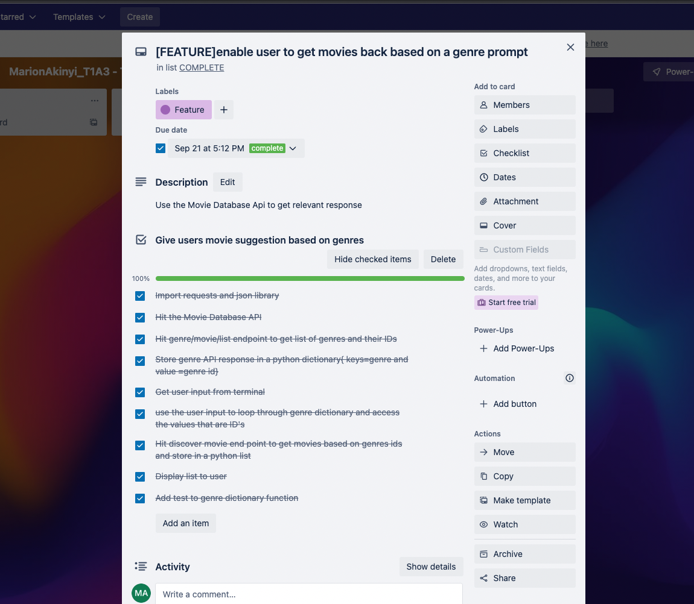
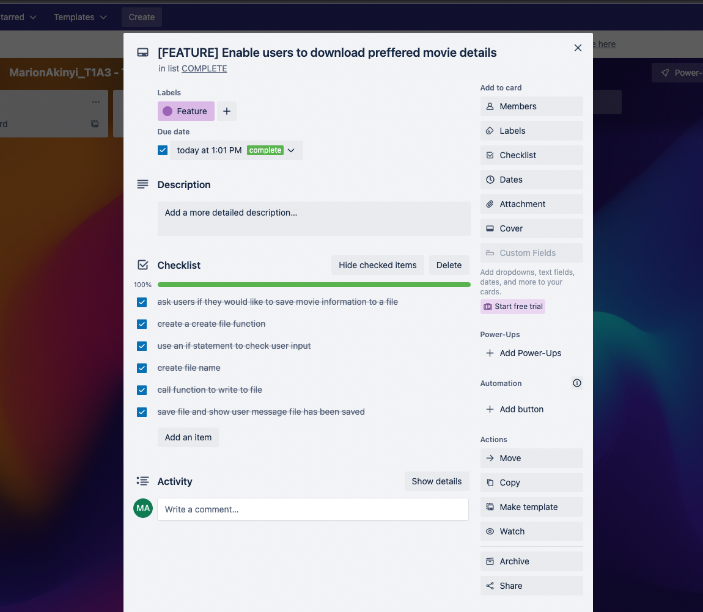
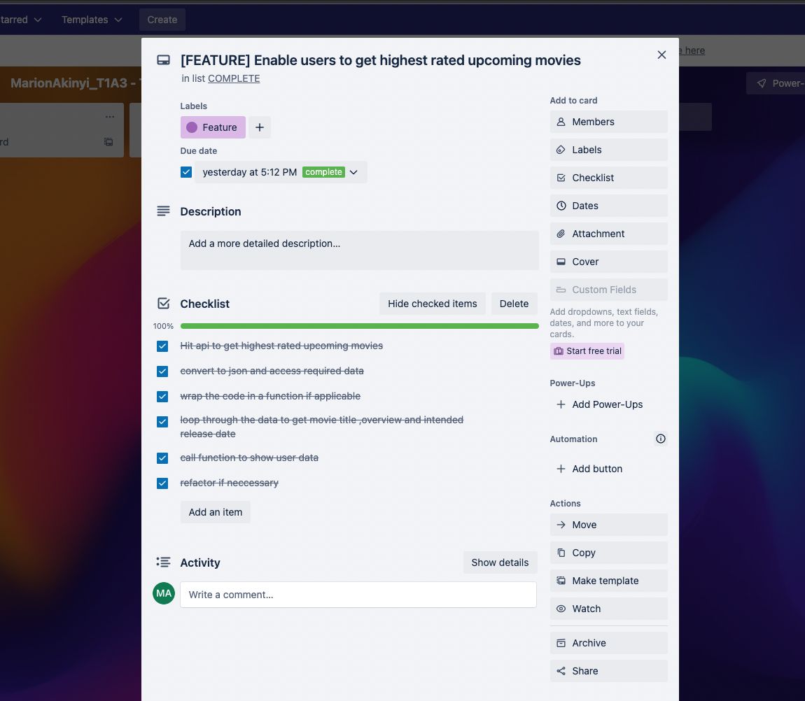
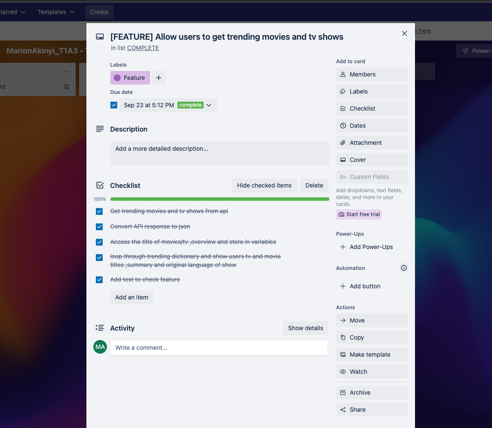

## Link to Github ##
[GITHUB](https://github.com/marie-debug/T1A3---Movie-Suggester)

## Link to Prsesentation ##
[youtube](https://youtu.be/jAWJv6GD8zA)

## Link to Trello ##
[Trello](https://trello.com/b/9Kf9qXPM/marionakinyit1a3-terminal-application)

## Code style guide ##

[pep8](https://peps.python.org/pep-0008/#documentation-strings)

## Features ##
### Movie recomendation by genre:
   
Based on a genre the app gives users title and summary of top 10 movies

### Get trending movies:
   
The app suggests latest top 10 movies with their title, summary and rating
### Get upcoming movies: 
The app suggests top 10 upcoming movies and provides title, summary and release date
### Save movie details
  
The app allows users to save movie details to file

## Implementation plan ##

### Screenshots ###

## steps to install the application ##
Run wrapper.sh bash script  to install the application
The script is located in the root directory of the application

## dependencies required by the application ##

- colorama==0.4.5
- pyfiglet==0.8.post1
- pytest==7.1.3
- python-dotenv==0.21.0
- requests==2.28.1

## command line arguments made for the application ##

- [trend] Enter Trend to get top 10 trending movies and shows.

- [genre] Enter genre  to get top 10 movies and shows based on genres.

- [latest] Enter Latest to get top 10 upcoming movies and shows.

- [q] Enter q to quit.